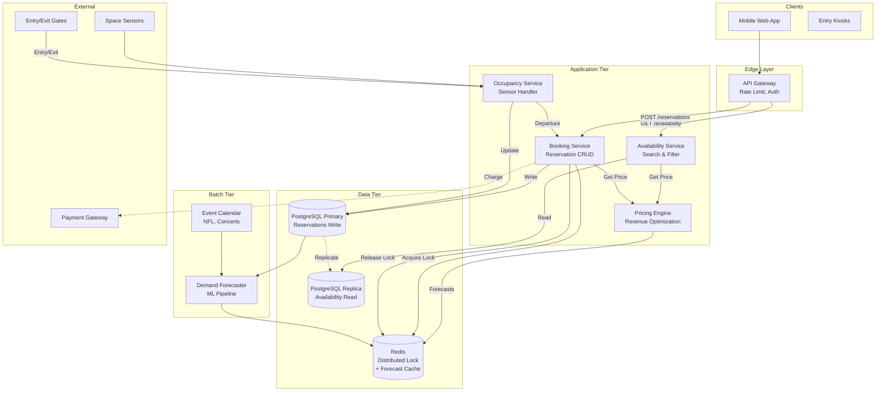
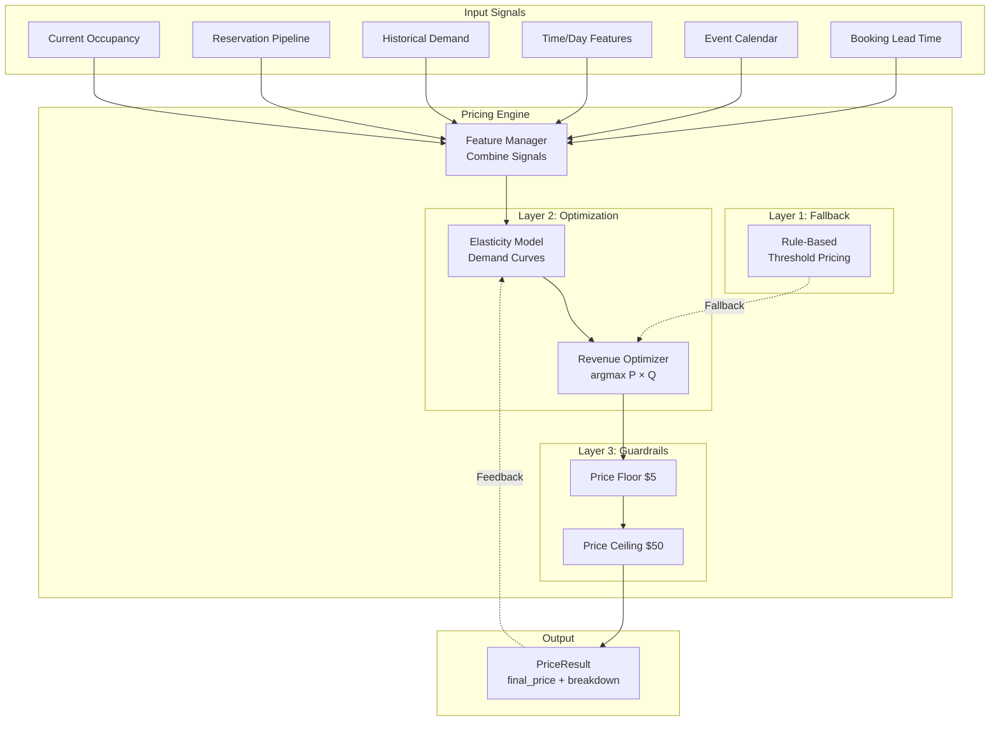

# PRD: Variable Pricing Parking Garage Demo

## Overview

**Product:** Interactive demo application showcasing a revenue-maximizing variable pricing system for a parking garage.

**Context:** Portfolio piece demonstrating system design thinking, optimization logic, and ability to build functional prototypes.

**Theme:** FIFA World Cup 2026 — MetLife Stadium, New Jersey.

---

## Objectives

1. Demonstrate a working variable pricing engine that adjusts prices based on multiple factors
2. Visualize how the system responds to demand changes in real-time
3. Provide an operator view showing revenue impact of dynamic pricing
4. Make the underlying system logic transparent and understandable
5. Create an intuitive, polished experience suitable for stakeholder demo

---

## Users

| User Type | Description |
|-----------|-------------|
| **Demo Viewer** | Evaluating candidate's technical depth and product thinking |
| **Simulated Parker** | Interactive role: selects and books parking spaces |
| **Simulated Operator** | Observes revenue, occupancy, and pricing metrics |

---

## Functional Requirements

### FR1: Garage Visualization

- Display a 500-space parking garage in a grid/map layout
- Spot types: Standard (400), EV (75), Motorcycle (25)
- Visual distinction between spot types (color coding)
- Show entrance/exit locations on the map
- Spots indicate availability status: Available (green), Booked (red), Selected (highlight)
- Hovering or selecting a spot reveals: spot ID, type, location, current price

### FR2: Time Simulation

- Time slider control allowing user to scrub through a full day (6:00 AM – 11:59 PM)
- Play/pause button to auto-advance time (1× speed = 1 sim-hour per 10 real-seconds, full day in ~3 minutes)
- Speed controls (2×, 5×, 10×) deferred to post-MVP; MVP ships with play/pause at 1× only
- Current simulated time displayed prominently
- Game time fixed at 7:00 PM (World Cup match kickoff)
- Pricing and demand patterns respond to simulated time
- **End of day:** When time reaches 11:59 PM, auto-stop with a "Day Complete" summary overlay showing final revenue, total bookings, peak occupancy, and average price

### FR3: Booking Flow

- User clicks an available spot to select it
- **Slide-out side panel** appears from the right showing: spot details, current price, price breakdown (factors contributing to price)
- **Price locking:** Price is locked on spot selection (not on booking confirmation). Server creates a 30-second hold on the selected spot — simulation cannot book it during this window
- User selects booking duration (1-4 hours)
- "Book" button confirms reservation
- Spot status updates immediately upon booking
- Booking confirmation displays: spot ID, time window, locked price, total cost

### FR4: Simulated Demand (Auto-Booking & Clearing)

- Toggle switch: "Simulate Other Users"
- When enabled, system performs two types of actions:

**Auto-Booking:**
- Automatically books random available spots
- Rate: 1 booking every 1-3 seconds (randomized)
- Booking probability influenced by current price (price-sensitive simulation)
- Simulated bookings follow demand curve tied to game time

**Auto-Clearing (Departures):**
- Reservations whose end_time has passed are automatically cleared
- Early departures: random chance (10%) that active reservation ends early
- Cleared spots return to available inventory
- Departure logged in event log

- **Subtle visual indicator** distinguishes simulated vs. user bookings — same color family, small icon or slightly different shade (not distinct colors)

### FR5: Pricing Engine

The pricing engine implements a revenue-maximizing optimization approach, not just rule-based multipliers.

#### Objective Function

```
Maximize: Revenue = Price × Expected_Bookings(Price)
```

The engine must find the price point where the product of price and demand is maximized, accounting for the inverse relationship between price and demand.

#### Price Elasticity Model

**Core Concept:** Price Elasticity of Demand (PED)

```
PED = (% Change in Quantity Demanded) / (% Change in Price)
```

| PED Value | Meaning | Strategy |
|-----------|---------|----------|
| |PED| < 1 | Inelastic demand | Raise prices |
| |PED| > 1 | Elastic demand | Lower prices capture volume |
| |PED| = 1 | Unit elastic | Revenue stable |

**Demand Model:**

```
Q(P) = A × P^(-e)

Where:
  Q = expected bookings (demand)
  P = price
  A = baseline demand constant (varies by time, event, etc.)
  e = elasticity exponent (calibrated per segment)
```

**Revenue Function:**

```
R(P) = P × Q(P) = P × A × P^(-e) = A × P^(1-e)
```

#### Elasticity Parameters (by segment)

| Segment | Elasticity (e) | Rationale |
|---------|----------------|-----------|
| Standard, far from entrance | 1.3 | Price sensitive, alternatives exist |
| Standard, near entrance | 0.9 | Convenience premium, less elastic |
| EV charging | 0.7 | Captive demand, need charger |
| Motorcycle | 1.1 | Moderate elasticity |
| Last-minute booking (<1hr) | 0.6 | Time pressure, inelastic |
| Advance booking (>4hr) | 1.4 | Can shop around, elastic |

#### Input Signals

| Signal | Source | Impact |
|--------|--------|--------|
| Current occupancy by type | Real-time state | Scarcity signal |
| Reservation pipeline | Active bookings for next 2 hours | Forward demand |
| Time of day | Simulated clock | Cyclical patterns |
| Demand forecast | Pre-loaded curve | Expected baseline |
| Event type | World Cup game | Major demand multiplier |
| Booking lead time | Time until reservation starts | Elasticity adjustment |

#### Price Calculation (Three Layers)

**Layer 1: Baseline Price**

```python
base_price = CONFIG.base_prices[spot_type]  # $10, $15, $5
```

**Layer 2: Context Multipliers**

```python
occupancy_mult = get_occupancy_multiplier(current_occupancy)
time_mult = get_time_multiplier(current_time, game_time)
demand_mult = get_demand_forecast_multiplier(current_time)
location_mult = get_location_multiplier(distance_to_entrance)
event_mult = CONFIG.event_multiplier  # 2.0 for World Cup
```

**Occupancy Multiplier Curve (Non-linear):**

```python
def get_occupancy_multiplier(occupancy_pct: float) -> float:
    if occupancy_pct <= 0.5:
        return 1.0
    elif occupancy_pct <= 0.7:
        return 1.0 + 0.5 * ((occupancy_pct - 0.5) / 0.2)
    elif occupancy_pct <= 0.9:
        return 1.5 + 1.0 * ((occupancy_pct - 0.7) / 0.2)
    else:
        return 2.5 + 1.5 * ((occupancy_pct - 0.9) / 0.1)
```

**Layer 3: Elasticity-Adjusted Optimization**

```python
def calculate_optimal_price(base_price, multipliers, elasticity, demand_baseline):
    """
    Find price that maximizes revenue given elasticity.
    
    For inelastic demand (e < 1): push toward ceiling
    For elastic demand (e > 1): find equilibrium point
    """
    context_price = base_price * product(multipliers)
    
    if elasticity < 1:
        # Inelastic: higher price = higher revenue
        # Constrained by ceiling and customer tolerance
        optimal = context_price * (1 + (1 - elasticity))
    else:
        # Elastic: balance price vs. volume
        # Optimal price where marginal revenue = 0
        optimal = context_price * (elasticity / (elasticity - 1)) * 0.5
    
    return clamp(optimal, PRICE_FLOOR, PRICE_CEILING)
```

#### Guardrails

| Rule | Value | Purpose |
|------|-------|---------|
| Price floor | $5/hour | Cover minimum costs |
| Price ceiling | $50/hour | Prevent price gouging perception |
| ~~Max Δ per interval~~ | ~~±20%~~ | **Dropped** — prices jump freely for more dramatic demo effect |

#### Price Breakdown Output

For transparency, engine returns full breakdown:

```python
@dataclass
class PriceResult:
    final_price: float
    base_price: float
    occupancy_multiplier: float
    time_multiplier: float
    demand_multiplier: float
    location_multiplier: float
    event_multiplier: float
    elasticity: float
    elasticity_adjustment: float
    context_price: float  # Before elasticity adjustment
    optimization_note: str  # "Inelastic: pushed toward ceiling"
```

### FR6: Operator Panel

Right sidebar displaying real-time metrics as cards with large numbers. Dark background, light text (dashboard style).

| Metric | Description | MVP? |
|--------|-------------|------|
| **Current Revenue** | Sum of all completed bookings today | Yes |
| **Projected Revenue** | Demand-curve-weighted extrapolation of end-of-day revenue (uses pre-loaded demand forecast to weight remaining hours) | Yes |
| **Occupancy Rate** | % of spots currently booked, by type and total | Yes |
| **Average Price** | Mean price of bookings in current hour | Yes |
| **Bookings This Hour** | Count of reservations made | Yes |
| **Price Distribution** | Mini histogram or indicator showing current price spread | Post-MVP (Recharts) |
| **Demand Forecast** | Visual of expected demand curve for the day | Post-MVP (Recharts) |

Metrics update in real-time as bookings occur and time advances. Sparkline trend charts deferred to post-MVP.

### FR7: System Transparency ("Under the Hood") — Post-MVP

**Deferred to post-MVP.** Will be implemented as a collapsible bottom drawer that slides up over the garage grid.

- Current pricing calculation for selected spot (factor breakdown)
- Event log: rolling window of last 50 entries, newest at top
- Occupancy trend graph (over simulated time) — Recharts
- Revenue accumulation graph (over simulated time) — Recharts
- Active multipliers display (which factors are currently elevated)

### FR8: User Guide / Instructions

- **Intro modal on first load** explaining the demo purpose and basic controls
- Modal is dismissible and **re-openable via a "?" button** in the header
- Covers:
  - What the demo is demonstrating
  - How to book a spot
  - How to use time controls
  - What the operator panel shows
  - How the pricing engine works (simplified explanation)

### FR9: Reset Functionality

- "Reset Demo" button clears all state:
  - All bookings removed
  - Time reset to 6:00 AM
  - Revenue reset to $0
  - Simulation toggle off
- Confirmation prompt before reset

---

## Non-Functional Requirements

| Attribute | Requirement |
|-----------|-------------|
| **Performance** | UI updates within 100ms of state change |
| **Responsiveness** | Desktop only (1280px+ width). Show explicit "best viewed on desktop" message for smaller viewports |
| **Browser Support** | Chrome, Safari, Firefox (latest versions) |
| **Architecture** | React + TypeScript frontend, FastAPI (Python) backend, WebSocket for real-time communication |
| **State Management** | Single in-memory GarageState instance on the server. No database, no localStorage |
| **Deployment** | Railway (cloud-hosted, primary) + Docker Compose (local). Must be easy for anyone to try without setup |

---

## System Design Reference

This demo implements the system design developed during interview preparation. The following diagrams represent the production architecture that this demo simulates.

### Production System Architecture



### Pricing Engine Architecture



### Key Design Decisions

| Decision | Production | Demo Simulation |
|----------|------------|-----------------|
| **Data Store** | PostgreSQL + Redis | Single in-memory GarageState in FastAPI process |
| **Concurrency** | Redis distributed locks | Server-side spot hold (30s lock on selection) |
| **Pricing** | Synchronous calculation | Same logic, server-side via FastAPI |
| **Real-time Updates** | Kafka event stream | WebSocket push (hybrid: deltas for ticks, full snapshot on connect/actions) |
| **Sensor Input** | Real sensors via Kafka | Simulated via server-side tick loop |
| **Demand Forecast** | ML pipeline (batch) | Pre-loaded curve |
| **Frontend** | Mobile + Kiosk apps | React + TypeScript + Tailwind CSS (desktop only, 1280px+) |

### Data Model

```
Space
├── id: str
├── type: SpotType (STANDARD, EV, MOTORCYCLE)
├── zone: str (A, B, C)
├── row: int
├── col: int
└── distance_to_entrance: float

Reservation
├── id: str
├── space_id: str
├── start_time: datetime
├── end_time: datetime
├── price_locked: float
├── total_cost: float
├── is_simulated: bool
└── status: ReservationStatus (ACTIVE, COMPLETED, CANCELLED)
```

---

## Demo Technical Architecture

### Stack: React + TypeScript + FastAPI

**Rationale:** Python backend showcases the pricing engine logic. React + TypeScript frontend enables rich interactivity (hover, click, real-time WebSocket updates) that Streamlit cannot support. Tailwind CSS provides fast iteration toward a polished dashboard aesthetic. WebSocket enables true real-time simulation push from server to client.

### Application Structure

```
/
├── frontend/                    # React + TypeScript + Tailwind CSS
│   ├── src/
│   │   ├── components/
│   │   │   ├── GarageGrid/      # CSS Grid/Flexbox garage visualization (divs, not canvas)
│   │   │   ├── BookingPanel/    # Slide-out side panel for spot details + booking
│   │   │   ├── TimeControls/    # Time slider, play/pause button
│   │   │   ├── OperatorPanel/   # Right sidebar metrics dashboard (cards, Recharts post-MVP)
│   │   │   ├── SystemPanel/     # Collapsible bottom drawer (post-MVP)
│   │   │   └── IntroModal/      # Dismissible + re-openable intro modal
│   │   ├── context/             # React Context + useReducer for state management
│   │   ├── hooks/               # useWebSocket (auto-reconnect + exponential backoff)
│   │   └── types/               # TypeScript interfaces matching backend Pydantic models
│   └── package.json
├── backend/
│   ├── main.py                  # FastAPI entry point + WebSocket endpoint
│   ├── engine/
│   │   ├── pricing.py           # Three-layer pricing engine with elasticity
│   │   ├── simulation.py        # Auto-booking and clearing tick loop (post-MVP)
│   │   └── demand_forecast.py   # Pre-loaded hourly demand curve
│   ├── models/
│   │   ├── space.py             # Space Pydantic model
│   │   ├── reservation.py       # Reservation Pydantic model
│   │   └── garage.py            # GarageState container
│   ├── config/
│   │   └── settings.py          # Pricing config, garage config, all tunable parameters
│   └── tests/
│       ├── test_pricing.py      # Pricing engine unit tests
│       └── test_api.py          # FastAPI + WebSocket integration tests
├── docker-compose.yml
├── Dockerfile.frontend
└── Dockerfile.backend
```

### WebSocket Protocol

- **Server → Client:** Hybrid payloads. Delta events during simulation ticks (individual bookings/departures). Full state snapshot on initial connect, after user actions, and on reconnect.
- **Client → Server:** User actions (select spot, book spot, play/pause, time scrub, reset).
- **Reconnection:** Frontend auto-reconnects with exponential backoff. Shows "reconnecting..." banner. On reconnect, requests full state snapshot to resync.

### Spot Selection & Race Conditions

When user selects a spot while simulation is running, the server creates a 30-second hold (temporary lock). The simulation engine skips locked spots. Price is calculated and locked at selection time. If the hold expires without booking, the spot is released.

### State Structure

Server-side state (single in-memory instance in FastAPI process):

```python
class GarageState(BaseModel):
    current_time: datetime
    is_playing: bool
    playback_speed: float          # 1.0 for MVP (1 sim-hr / 10 real-sec)
    spaces: List[Space]
    reservations: List[Reservation]
    held_space_ids: Dict[str, datetime]  # space_id -> hold_expires_at (30s locks)
    simulation_enabled: bool
    event_log: List[EventLogEntry]  # Rolling window, last 50

class Space(BaseModel):
    id: str
    type: SpotType
    zone: str
    row: int
    col: int
    distance_to_entrance: float

class Reservation(BaseModel):
    id: str
    space_id: str
    start_time: datetime
    end_time: datetime
    price_locked: float
    total_cost: float
    is_simulated: bool
    status: ReservationStatus

class EventLogEntry(BaseModel):
    timestamp: datetime
    event_type: str
    details: dict
```

Frontend state managed via React Context + useReducer, mirroring server state from WebSocket snapshots.

### Configuration

All configuration uses Pydantic models. Pricing parameters are tunable to calibrate dramatic demo output while keeping the economic model rigorous.

```python
class PricingConfig(BaseModel):
    base_prices: dict  # {STANDARD: 10, EV: 15, MOTORCYCLE: 5}
    elasticity_by_type: dict  # {STANDARD: 1.1, EV: 0.7, MOTORCYCLE: 1.0}
    event_multiplier: float  # 2.0 for World Cup
    price_floor: float  # 5.0
    price_ceiling: float  # 50.0
    time_multipliers: dict  # {hour: multiplier}
    location_multipliers: dict  # {zone: multiplier}
    # Note: ±20% smoothing guardrail removed — prices jump freely

class SimulationConfig(BaseModel):  # Post-MVP
    base_booking_probability: float  # 0.3
    early_departure_probability: float  # 0.02
    tick_interval_ms: int  # 500

class GarageConfig(BaseModel):
    total_spaces: int     # MVP: 100, Full: 500
    rows: int             # MVP: 10, Full: 20
    cols: int             # MVP: 10, Full: 25
    game_time: time       # 19:00
    spot_hold_seconds: int  # 30 (lock duration on selection)

DEMAND_FORECAST = {
    6: 0.05, 7: 0.05, 8: 0.08, 9: 0.10, 10: 0.12, 11: 0.15,
    12: 0.20, 13: 0.25, 14: 0.35, 15: 0.45, 16: 0.60,
    17: 0.80, 18: 0.95, 19: 1.00, 20: 0.85, 21: 0.60,
    22: 0.30, 23: 0.10
}
```

---

## Garage Layout

Grid size is configurable via `GarageConfig`. MVP uses 10×10 (100 spaces), scales to 25×20 (500 spaces) post-MVP.

**Full layout (500 spaces):**
- 25 columns × 20 rows
- Zones: A (near entrance), B (middle), C (far)
- Zone A: rows 1-5, Zone B: rows 6-15, Zone C: rows 16-20
- Entrance/exit marked at row 1, center columns
- Spot type distribution:
  - EV: Zone A, columns 1-3 (75 spots)
  - Motorcycle: Zone C, columns 23-25 (25 spots)
  - Standard: all remaining (400 spots)

**MVP layout (100 spaces):**
- 10 columns × 10 rows
- Same zone/type distribution logic, proportionally scaled

---

## UI/UX Specifications

### Theme: World Cup 2026 — MetLife Stadium

- Color palette: FIFA World Cup 2026 colors (deep blue, red, white accents)
- Header: "MetLife Stadium Parking — FIFA World Cup 2026"
- Subtle soccer/football iconography
- Professional, dashboard aesthetic

### Garage Map

- **Rendered as CSS Grid/Flexbox** — each spot is a plain HTML div. No canvas or SVG.
- Cell colors:
  - Available: Green (shade varies by type)
  - Booked (simulated): Red (muted)
  - Booked (user): Red with subtle distinguishing indicator (small icon or slightly different shade)
  - Selected: Yellow highlight / border
  - EV spots: Blue-green tint
  - Motorcycle spots: Orange tint
- Entrance marker: Icon or label at top-center
- Hover tooltip: Spot ID, type, price
- Click: selects spot, opens slide-out booking panel from right

### Operator Panel (Right Sidebar)

- Dark background, light text (dashboard style)
- Metrics displayed as cards with large numbers
- Mini charts for trends (sparklines) — **post-MVP, using Recharts**
- Projected revenue uses demand-curve-weighted extrapolation
- Updates animate smoothly

### System Panel (Collapsible Bottom Drawer) — Post-MVP

- Slides up from bottom of page over the garage grid
- Event log: rolling window of last 50 entries, newest at top
- Price breakdown: table showing each factor and multiplier
- Graphs: Recharts line charts for occupancy and revenue over time

### Time Controls (Top Bar)

- Slider: full day range (6 AM – 11:59 PM)
- Play/Pause button (1× speed = 1 sim-hour per 10 real-seconds)
- Speed selector (2×, 5×, 10×) — **post-MVP**
- Current time display: large, prominent

---

## Demo Flow (Expected User Journey)

1. **Load**: User sees intro modal explaining the demo
2. **Explore**: User dismisses modal, sees garage at 6 AM, mostly empty, low prices
3. **Book**: User clicks a spot, sees price breakdown, books it
4. **Enable Simulation**: User toggles simulation, watches spots fill up
5. **Advance Time**: User plays or scrubs time forward, watches prices increase
6. **Observe Operator Panel**: Revenue climbs, occupancy increases, prices adjust
7. **Peak Demand**: Near 7 PM, garage nearly full, prices at maximum
8. **Inspect System**: User opens "under the hood" panel, sees event log, multipliers
9. **Reset**: User resets to start over or demo different scenarios

---

## Success Criteria

| Criteria | Measure |
|----------|---------|
| Pricing engine correctly responds to all factors | Manual verification of price changes |
| Simulation fills garage over time | Occupancy reaches 90%+ by 7 PM with simulation on |
| Operator metrics update in real-time | Visual confirmation |
| Demo is self-explanatory | Viewer understands system without external explanation |
| Polished, professional appearance | Comparable to Palantir demo quality |
| Runs without errors | No console errors, no crashes during full demo flow |

---

## MVP Scope (This Weekend)

**In:**
- 10×10 grid (100 spaces), configurable to scale to 500
- Pricing engine with three-layer model + tunable params
- Manual booking flow (click spot → slide-out panel → select duration → book)
- Time slider with play/pause at 1× speed (1 sim-hour per 10 real-seconds, full day in ~3 min)
- Operator panel with numeric metric cards (no charts)
- Intro modal (dismissible + re-openable via "?")
- Desktop-only layout with "best viewed on desktop" message for smaller viewports
- FastAPI backend with WebSocket
- Pricing engine unit tests + API integration tests
- Docker Compose for local deployment

**Deferred (post-MVP):**
- Auto-booking simulation engine (server-side tick loop)
- System transparency panel (collapsible bottom drawer)
- Speed controls (2×/5×/10×)
- Recharts sparklines and trend graphs in operator panel
- Scale to full 500-space grid (25×20)
- Railway cloud deployment
- End-of-day summary overlay

## Out of Scope (All Phases)

- Backend persistence / database
- User authentication
- Payment processing
- Multi-garage support
- Mobile-optimized layout
- Accessibility (WCAG compliance)

---

## Appendix: Pricing Engine Implementation

```python
class PricingEngine:
    def __init__(self, config: PricingConfig):
        self.config = config
    
    def calculate_price(
        self,
        space: Space,
        current_time: datetime,
        garage_state: GarageState,
        booking_lead_time: timedelta
    ) -> PriceResult:
        
        # Layer 1: Base price
        base = self.config.base_prices[space.type]
        
        # Layer 2: Context multipliers
        occ_mult = self._occupancy_multiplier(garage_state.occupancy_rate)
        time_mult = self._time_multiplier(current_time)
        demand_mult = self._demand_multiplier(current_time)
        loc_mult = self._location_multiplier(space.distance_to_entrance)
        event_mult = self.config.event_multiplier
        
        context_price = base * occ_mult * time_mult * demand_mult * loc_mult * event_mult
        
        # Layer 3: Elasticity optimization
        elasticity = self._get_elasticity(space, booking_lead_time)
        optimal_price, note = self._optimize_for_elasticity(context_price, elasticity)
        
        # Guardrails
        final_price = max(self.config.price_floor, min(self.config.price_ceiling, optimal_price))
        
        return PriceResult(
            final_price=round(final_price, 2),
            breakdown={...},
            optimization_note=note
        )
    
    def _occupancy_multiplier(self, occ: float) -> float:
        if occ <= 0.5:
            return 1.0
        elif occ <= 0.7:
            return 1.0 + 0.5 * ((occ - 0.5) / 0.2)
        elif occ <= 0.9:
            return 1.5 + 1.0 * ((occ - 0.7) / 0.2)
        else:
            return 2.5 + 1.5 * ((min(occ, 1.0) - 0.9) / 0.1)
    
    def _get_elasticity(self, space: Space, lead_time: timedelta) -> float:
        base_elasticity = self.config.elasticity_by_type[space.type]
        
        if space.zone == 'A':
            base_elasticity *= 0.85
        elif space.zone == 'C':
            base_elasticity *= 1.15
        
        if lead_time < timedelta(hours=1):
            base_elasticity *= 0.7
        elif lead_time > timedelta(hours=4):
            base_elasticity *= 1.2
        
        return base_elasticity
    
    def _optimize_for_elasticity(self, context_price: float, elasticity: float) -> tuple:
        if elasticity < 0.8:
            adjustment = 1 + (0.8 - elasticity) * 0.5
            note = f"Inelastic (e={elasticity:.2f}): price pushed up"
        elif elasticity < 1.0:
            adjustment = 1 + (1.0 - elasticity) * 0.3
            note = f"Moderately inelastic (e={elasticity:.2f}): slight premium"
        elif elasticity < 1.2:
            adjustment = 1.0
            note = f"Unit elastic (e={elasticity:.2f}): price stable"
        else:
            adjustment = 1 - (elasticity - 1.2) * 0.2
            adjustment = max(0.7, adjustment)
            note = f"Elastic (e={elasticity:.2f}): price reduced for volume"
        
        return context_price * adjustment, note
```

---

## Appendix: Simulation Engine Implementation

```python
class SimulationEngine:
    def __init__(self, config: SimulationConfig):
        self.config = config
    
    def tick(self, state: AppState, pricing_engine: PricingEngine) -> List[EventLogEntry]:
        events = []
        events.extend(self._process_departures(state))
        
        if self._should_book(state):
            event = self._simulate_booking(state, pricing_engine)
            if event:
                events.append(event)
        
        return events
    
    def _process_departures(self, state: AppState) -> List[EventLogEntry]:
        events = []
        for res in state.reservations:
            if res.status != ReservationStatus.ACTIVE:
                continue
            
            if state.current_time >= res.end_time:
                res.status = ReservationStatus.COMPLETED
                events.append(EventLogEntry(
                    timestamp=state.current_time,
                    event_type='DEPARTURE',
                    details={'space_id': res.space_id, 'type': 'completed'}
                ))
            elif random.random() < self.config.early_departure_probability:
                res.status = ReservationStatus.COMPLETED
                res.end_time = state.current_time
                events.append(EventLogEntry(
                    timestamp=state.current_time,
                    event_type='DEPARTURE',
                    details={'space_id': res.space_id, 'type': 'early'}
                ))
        
        return events
    
    def _should_book(self, state: AppState) -> bool:
        demand_level = DEMAND_FORECAST.get(state.current_time.hour, 0.1)
        return random.random() < (self.config.base_booking_probability * demand_level)
    
    def _simulate_booking(self, state: AppState, pricing_engine: PricingEngine) -> Optional[EventLogEntry]:
        available = [s for s in state.spaces if self._is_available(s, state)]
        if not available:
            return None
        
        # Price-sensitive selection
        prices = [pricing_engine.calculate_price(s, state.current_time, state, timedelta(hours=1)).final_price for s in available]
        weights = [1.0 / p for p in prices]
        total = sum(weights)
        weights = [w / total for w in weights]
        
        selected = random.choices(available, weights=weights, k=1)[0]
        duration = random.choice([1, 2, 3, 4])
        
        price_result = pricing_engine.calculate_price(selected, state.current_time, state, timedelta(hours=1))
        
        reservation = Reservation(
            id=str(uuid.uuid4()),
            space_id=selected.id,
            start_time=state.current_time,
            end_time=state.current_time + timedelta(hours=duration),
            price_locked=price_result.final_price,
            total_cost=price_result.final_price * duration,
            is_simulated=True,
            status=ReservationStatus.ACTIVE
        )
        
        state.reservations.append(reservation)
        
        return EventLogEntry(
            timestamp=state.current_time,
            event_type='BOOKING',
            details={'space_id': selected.id, 'price': price_result.final_price, 'duration': duration, 'simulated': True}
        )
```
