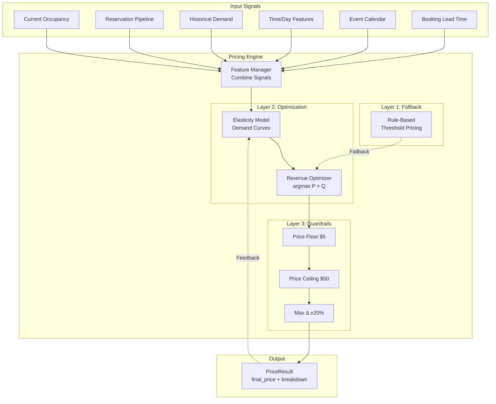

# PRD: Variable Pricing Parking Garage Demo

## Overview

**Product:** Interactive demo application showcasing a revenue-maximizing variable pricing system for a parking garage.

**Context:** Portfolio piece for Arena AI Product Management candidacy. Demonstrates system design thinking, optimization logic, and ability to build functional prototypes.

**Theme:** FIFA World Cup 2026 — MetLife Stadium, New Jersey.

---

## Objectives

1. Demonstrate a working variable pricing engine that adjusts prices based on multiple factors
2. Visualize how the system responds to demand changes in real-time
3. Provide an operator view showing revenue impact of dynamic pricing
4. Make the underlying system logic transparent and understandable
5. Create an intuitive, polished experience suitable for stakeholder demo

---

## Users

| User Type | Description |
|-----------|-------------|
| **Demo Viewer (Arena Team)** | Evaluating candidate's technical depth and product thinking |
| **Simulated Parker** | Interactive role: selects and books parking spaces |
| **Simulated Operator** | Observes revenue, occupancy, and pricing metrics |

---

## Functional Requirements

### FR1: Garage Visualization

- Display a 500-space parking garage in a grid/map layout
- Spot types: Standard (400), EV (75), Motorcycle (25)
- Visual distinction between spot types (color coding)
- Show entrance/exit locations on the map
- Spots indicate availability status: Available (green), Booked (red), Selected (highlight)
- Hovering or selecting a spot reveals: spot ID, type, location, current price

### FR2: Time Simulation

- Time slider control allowing user to scrub through a full day (6:00 AM – 11:59 PM)
- Play/pause button to auto-advance time at configurable speed (e.g., 1 sim-hour per 5 real-seconds)
- Current simulated time displayed prominently
- Game time fixed at 7:00 PM (World Cup match kickoff)
- Pricing and demand patterns respond to simulated time

### FR3: Booking Flow

- User clicks an available spot to select it
- Selection panel shows: spot details, current price, price breakdown (factors contributing to price)
- User selects booking duration (1-4 hours)
- "Book" button confirms reservation
- Spot status updates immediately upon booking
- Booking confirmation displays: spot ID, time window, locked price, total cost

### FR4: Simulated Demand (Auto-Booking & Clearing)

- Toggle switch: "Simulate Other Users"
- When enabled, system performs two types of actions:

**Auto-Booking:**
- Automatically books random available spots
- Rate: 1 booking every 1-3 seconds (randomized)
- Booking probability influenced by current price (price-sensitive simulation)
- Simulated bookings follow demand curve tied to game time

**Auto-Clearing (Departures):**
- Reservations whose end_time has passed are automatically cleared
- Early departures: random chance (10%) that active reservation ends early
- Cleared spots return to available inventory
- Departure logged in event log

- Visual indication distinguishes simulated vs. user bookings

### FR5: Pricing Engine

The pricing engine implements a revenue-maximizing optimization approach, not just rule-based multipliers.

#### Objective Function

```
Maximize: Revenue = Price × Expected_Bookings(Price)
```

The engine must find the price point where the product of price and demand is maximized, accounting for the inverse relationship between price and demand.

#### Price Elasticity Model

**Core Concept:** Price Elasticity of Demand (PED)

```
PED = (% Change in Quantity Demanded) / (% Change in Price)
```

| PED Value | Meaning | Strategy |
|-----------|---------|----------|
| |PED| < 1 | Inelastic demand | Raise prices |
| |PED| > 1 | Elastic demand | Lower prices capture volume |
| |PED| = 1 | Unit elastic | Revenue stable |

**Demand Model:**

```
Q(P) = A × P^(-e)

Where:
  Q = expected bookings (demand)
  P = price
  A = baseline demand constant (varies by time, event, etc.)
  e = elasticity exponent (calibrated per segment)
```

**Revenue Function:**

```
R(P) = P × Q(P) = P × A × P^(-e) = A × P^(1-e)
```

#### Elasticity Parameters (by segment)

| Segment | Elasticity (e) | Rationale |
|---------|----------------|-----------|
| Standard, far from entrance | 1.3 | Price sensitive, alternatives exist |
| Standard, near entrance | 0.9 | Convenience premium, less elastic |
| EV charging | 0.7 | Captive demand, need charger |
| Motorcycle | 1.1 | Moderate elasticity |
| Last-minute booking (<1hr) | 0.6 | Time pressure, inelastic |
| Advance booking (>4hr) | 1.4 | Can shop around, elastic |

#### Input Signals

| Signal | Source | Impact |
|--------|--------|--------|
| Current occupancy by type | Real-time state | Scarcity signal |
| Reservation pipeline | Active bookings for next 2 hours | Forward demand |
| Time of day | Simulated clock | Cyclical patterns |
| Demand forecast | Pre-loaded curve | Expected baseline |
| Event type | World Cup game | Major demand multiplier |
| Booking lead time | Time until reservation starts | Elasticity adjustment |

#### Price Calculation (Three Layers)

**Layer 1: Baseline Price**

```python
base_price = CONFIG.base_prices[spot_type]  # $10, $15, $5
```

**Layer 2: Context Multipliers**

```python
occupancy_mult = get_occupancy_multiplier(current_occupancy)
time_mult = get_time_multiplier(current_time, game_time)
demand_mult = get_demand_forecast_multiplier(current_time)
location_mult = get_location_multiplier(distance_to_entrance)
event_mult = CONFIG.event_multiplier  # 2.0 for World Cup
```

**Occupancy Multiplier Curve (Non-linear):**

```python
def get_occupancy_multiplier(occupancy_pct: float) -> float:
    if occupancy_pct <= 0.5:
        return 1.0
    elif occupancy_pct <= 0.7:
        return 1.0 + 0.5 * ((occupancy_pct - 0.5) / 0.2)
    elif occupancy_pct <= 0.9:
        return 1.5 + 1.0 * ((occupancy_pct - 0.7) / 0.2)
    else:
        return 2.5 + 1.5 * ((occupancy_pct - 0.9) / 0.1)
```

**Layer 3: Elasticity-Adjusted Optimization**

```python
def calculate_optimal_price(base_price, multipliers, elasticity, demand_baseline):
    """
    Find price that maximizes revenue given elasticity.
    
    For inelastic demand (e < 1): push toward ceiling
    For elastic demand (e > 1): find equilibrium point
    """
    context_price = base_price * product(multipliers)
    
    if elasticity < 1:
        # Inelastic: higher price = higher revenue
        # Constrained by ceiling and customer tolerance
        optimal = context_price * (1 + (1 - elasticity))
    else:
        # Elastic: balance price vs. volume
        # Optimal price where marginal revenue = 0
        optimal = context_price * (elasticity / (elasticity - 1)) * 0.5
    
    return clamp(optimal, PRICE_FLOOR, PRICE_CEILING)
```

#### Guardrails

| Rule | Value | Purpose |
|------|-------|---------|
| Price floor | $5/hour | Cover minimum costs |
| Price ceiling | $50/hour | Prevent price gouging perception |
| Max Δ per interval | ±20% | Avoid price shock |

#### Price Breakdown Output

For transparency, engine returns full breakdown:

```python
@dataclass
class PriceResult:
    final_price: float
    base_price: float
    occupancy_multiplier: float
    time_multiplier: float
    demand_multiplier: float
    location_multiplier: float
    event_multiplier: float
    elasticity: float
    elasticity_adjustment: float
    context_price: float  # Before elasticity adjustment
    optimization_note: str  # "Inelastic: pushed toward ceiling"
```

### FR6: Operator Panel

Side panel displaying real-time metrics:

| Metric | Description |
|--------|-------------|
| **Current Revenue** | Sum of all completed bookings today |
| **Projected Revenue** | Estimated end-of-day revenue based on current booking rate and pricing |
| **Occupancy Rate** | % of spots currently booked, by type and total |
| **Average Price** | Mean price of bookings in current hour |
| **Bookings This Hour** | Count of reservations made |
| **Price Distribution** | Mini histogram or indicator showing current price spread |
| **Demand Forecast** | Visual of expected demand curve for the day |

Metrics update in real-time as bookings occur and time advances.

### FR7: System Transparency ("Under the Hood")

Dedicated section or expandable panel showing:

- Current pricing calculation for selected spot (factor breakdown)
- Event log: recent bookings with timestamps, prices, and factors
- Occupancy trend graph (over simulated time)
- Revenue accumulation graph (over simulated time)
- Active multipliers display (which factors are currently elevated)

### FR8: User Guide / Instructions

- On-screen guide accessible via "Help" or "?" button
- Covers:
  - How to navigate the demo
  - How to book a spot
  - How to use time controls
  - What the operator panel shows
  - How the pricing engine works (simplified explanation)
  - What the demo is demonstrating (context for Arena team)
- Consider: brief intro modal on first load explaining the demo purpose

### FR9: Reset Functionality

- "Reset Demo" button clears all state:
  - All bookings removed
  - Time reset to 6:00 AM
  - Revenue reset to $0
  - Simulation toggle off
- Confirmation prompt before reset

---

## Non-Functional Requirements

| Attribute | Requirement |
|-----------|-------------|
| **Performance** | UI updates within 100ms of state change |
| **Responsiveness** | Usable on desktop (1280px+ width); tablet acceptable, mobile not required |
| **Browser Support** | Chrome, Safari, Firefox (latest versions) |
| **No Backend Required** | Entire demo runs client-side |
| **State Management** | All state in memory; no localStorage/sessionStorage |

---

## System Design Reference

This demo implements the system design developed during interview preparation. The following diagrams represent the production architecture that this demo simulates.

### Production System Architecture


### Pricing Engine Architecture



### Key Design Decisions

| Decision | Production | Demo Simulation |
|----------|------------|-----------------|
| **Data Store** | PostgreSQL + Redis | In-memory (Streamlit session state) |
| **Concurrency** | Redis distributed locks | Single-threaded (no locks needed) |
| **Pricing** | Synchronous calculation | Same logic, client-side |
| **Sensor Input** | Real sensors via Kafka | Simulated via tick loop |
| **Demand Forecast** | ML pipeline (batch) | Pre-loaded curve |

### Data Model

```
Space
├── id: str
├── type: SpotType (STANDARD, EV, MOTORCYCLE)
├── zone: str (A, B, C)
├── row: int
├── col: int
└── distance_to_entrance: float

Reservation
├── id: str
├── space_id: str
├── start_time: datetime
├── end_time: datetime
├── price_locked: float
├── total_cost: float
├── is_simulated: bool
└── status: ReservationStatus (ACTIVE, COMPLETED, CANCELLED)
```

---

## Demo Technical Architecture

### Recommended Stack: Python + Streamlit

**Rationale:** Python aligns with Arena's technical stack and candidate's coding strengths. Streamlit enables rapid prototyping of interactive data applications with minimal frontend code. Allows focus on pricing engine logic rather than UI boilerplate.

### Application Structure

```
parking_demo/
├── main.py                 # Streamlit entry point
├── components/
│   ├── garage_map.py       # Grid visualization
│   ├── selection_panel.py  # Spot details, booking
│   ├── time_controls.py    # Slider, play/pause
│   ├── operator_panel.py   # Metrics dashboard
│   ├── system_panel.py     # Under-the-hood view
│   └── help_modal.py       # User guide
├── engine/
│   ├── pricing.py          # Pricing engine with elasticity
│   ├── simulation.py       # Auto-booking and clearing
│   └── demand_forecast.py  # Demand curve logic
├── models/
│   ├── space.py            # Space dataclass
│   ├── reservation.py      # Reservation dataclass
│   └── garage.py           # Garage state container
├── config/
│   └── settings.py         # Pricing config, constants
└── utils/
    └── helpers.py          # Shared utilities
```

### State Structure

```python
@dataclass
class AppState:
    current_time: datetime
    is_playing: bool
    playback_speed: float
    spaces: List[Space]
    reservations: List[Reservation]
    selected_space_id: Optional[str]
    selected_duration: int
    simulation_enabled: bool
    event_log: List[EventLogEntry]

@dataclass
class Space:
    id: str
    type: SpotType
    zone: str
    row: int
    col: int
    distance_to_entrance: float
    
@dataclass
class Reservation:
    id: str
    space_id: str
    start_time: datetime
    end_time: datetime
    price_locked: float
    total_cost: float
    is_simulated: bool
    status: ReservationStatus

@dataclass 
class EventLogEntry:
    timestamp: datetime
    event_type: str
    details: dict
```

### Configuration

```python
@dataclass
class PricingConfig:
    base_prices: dict  # {STANDARD: 10, EV: 15, MOTORCYCLE: 5}
    elasticity_by_type: dict  # {STANDARD: 1.1, EV: 0.7, MOTORCYCLE: 1.0}
    event_multiplier: float  # 2.0 for World Cup
    price_floor: float  # 5.0
    price_ceiling: float  # 50.0
    time_multipliers: dict  # {hour: multiplier}
    location_multipliers: dict  # {zone: multiplier}

@dataclass
class SimulationConfig:
    base_booking_probability: float  # 0.3
    early_departure_probability: float  # 0.02
    tick_interval_ms: int  # 500

@dataclass
class GarageConfig:
    total_spaces: int  # 500
    standard_count: int  # 400
    ev_count: int  # 75
    motorcycle_count: int  # 25
    rows: int  # 20
    cols: int  # 25
    game_time: time  # 19:00

DEMAND_FORECAST = {
    6: 0.05, 7: 0.05, 8: 0.08, 9: 0.10, 10: 0.12, 11: 0.15,
    12: 0.20, 13: 0.25, 14: 0.35, 15: 0.45, 16: 0.60,
    17: 0.80, 18: 0.95, 19: 1.00, 20: 0.85, 21: 0.60,
    22: 0.30, 23: 0.10
}
```

---

## Garage Layout

- 500 spots arranged in grid: 25 columns × 20 rows
- Zones: A (near entrance), B (middle), C (far)
- Zone A: rows 1-5, Zone B: rows 6-15, Zone C: rows 16-20
- Entrance/exit marked at row 1, center columns
- Spot type distribution:
  - EV: Zone A, columns 1-3 (75 spots)
  - Motorcycle: Zone C, columns 23-25 (25 spots)
  - Standard: all remaining (400 spots)

---

## UI/UX Specifications

### Theme: World Cup 2026 — MetLife Stadium

- Color palette: FIFA World Cup 2026 colors (deep blue, red, white accents)
- Header: "MetLife Stadium Parking — FIFA World Cup 2026"
- Subtle soccer/football iconography
- Professional, dashboard aesthetic

### Garage Map

- Grid cells represent spots
- Cell colors:
  - Available: Green (shade varies by type)
  - Booked: Red (muted)
  - Selected: Yellow highlight / border
  - EV spots: Blue-green tint
  - Motorcycle spots: Orange tint
- Entrance marker: Icon or label at top-center
- Hover tooltip: Spot ID, type, price
- Click: selects spot, opens detail panel

### Operator Panel (Right Sidebar)

- Dark background, light text (dashboard style)
- Metrics displayed as cards with large numbers
- Mini charts for trends (sparklines)
- Updates animate smoothly

### System Panel (Collapsible Bottom or Tab)

- Event log: scrolling list, newest at top
- Price breakdown: table showing each factor and multiplier
- Graphs: line charts for occupancy and revenue over time

### Time Controls (Top Bar)

- Slider: full day range
- Play/Pause button
- Speed selector: 1×, 2×, 5×, 10×
- Current time display: large, prominent

---

## Demo Flow (Expected User Journey)

1. **Load**: User sees intro modal explaining the demo
2. **Explore**: User dismisses modal, sees garage at 6 AM, mostly empty, low prices
3. **Book**: User clicks a spot, sees price breakdown, books it
4. **Enable Simulation**: User toggles simulation, watches spots fill up
5. **Advance Time**: User plays or scrubs time forward, watches prices increase
6. **Observe Operator Panel**: Revenue climbs, occupancy increases, prices adjust
7. **Peak Demand**: Near 7 PM, garage nearly full, prices at maximum
8. **Inspect System**: User opens "under the hood" panel, sees event log, multipliers
9. **Reset**: User resets to start over or demo different scenarios

---

## Success Criteria

| Criteria | Measure |
|----------|---------|
| Pricing engine correctly responds to all factors | Manual verification of price changes |
| Simulation fills garage over time | Occupancy reaches 90%+ by 7 PM with simulation on |
| Operator metrics update in real-time | Visual confirmation |
| Demo is self-explanatory | Arena team understands system without external explanation |
| Polished, professional appearance | Comparable to Palantir demo quality |
| Runs without errors | No console errors, no crashes during full demo flow |

---

## Out of Scope (MVP)

- Backend persistence / database
- User authentication
- Payment processing
- Multi-garage support
- Mobile-optimized layout
- Accessibility (WCAG compliance)
- Automated testing

---

## Appendix: Pricing Engine Implementation

```python
class PricingEngine:
    def __init__(self, config: PricingConfig):
        self.config = config
    
    def calculate_price(
        self,
        space: Space,
        current_time: datetime,
        garage_state: GarageState,
        booking_lead_time: timedelta
    ) -> PriceResult:
        
        # Layer 1: Base price
        base = self.config.base_prices[space.type]
        
        # Layer 2: Context multipliers
        occ_mult = self._occupancy_multiplier(garage_state.occupancy_rate)
        time_mult = self._time_multiplier(current_time)
        demand_mult = self._demand_multiplier(current_time)
        loc_mult = self._location_multiplier(space.distance_to_entrance)
        event_mult = self.config.event_multiplier
        
        context_price = base * occ_mult * time_mult * demand_mult * loc_mult * event_mult
        
        # Layer 3: Elasticity optimization
        elasticity = self._get_elasticity(space, booking_lead_time)
        optimal_price, note = self._optimize_for_elasticity(context_price, elasticity)
        
        # Guardrails
        final_price = max(self.config.price_floor, min(self.config.price_ceiling, optimal_price))
        
        return PriceResult(
            final_price=round(final_price, 2),
            breakdown={...},
            optimization_note=note
        )
    
    def _occupancy_multiplier(self, occ: float) -> float:
        if occ <= 0.5:
            return 1.0
        elif occ <= 0.7:
            return 1.0 + 0.5 * ((occ - 0.5) / 0.2)
        elif occ <= 0.9:
            return 1.5 + 1.0 * ((occ - 0.7) / 0.2)
        else:
            return 2.5 + 1.5 * ((min(occ, 1.0) - 0.9) / 0.1)
    
    def _get_elasticity(self, space: Space, lead_time: timedelta) -> float:
        base_elasticity = self.config.elasticity_by_type[space.type]
        
        if space.zone == 'A':
            base_elasticity *= 0.85
        elif space.zone == 'C':
            base_elasticity *= 1.15
        
        if lead_time < timedelta(hours=1):
            base_elasticity *= 0.7
        elif lead_time > timedelta(hours=4):
            base_elasticity *= 1.2
        
        return base_elasticity
    
    def _optimize_for_elasticity(self, context_price: float, elasticity: float) -> tuple:
        if elasticity < 0.8:
            adjustment = 1 + (0.8 - elasticity) * 0.5
            note = f"Inelastic (e={elasticity:.2f}): price pushed up"
        elif elasticity < 1.0:
            adjustment = 1 + (1.0 - elasticity) * 0.3
            note = f"Moderately inelastic (e={elasticity:.2f}): slight premium"
        elif elasticity < 1.2:
            adjustment = 1.0
            note = f"Unit elastic (e={elasticity:.2f}): price stable"
        else:
            adjustment = 1 - (elasticity - 1.2) * 0.2
            adjustment = max(0.7, adjustment)
            note = f"Elastic (e={elasticity:.2f}): price reduced for volume"
        
        return context_price * adjustment, note
```

---

## Appendix: Simulation Engine Implementation

```python
class SimulationEngine:
    def __init__(self, config: SimulationConfig):
        self.config = config
    
    def tick(self, state: AppState, pricing_engine: PricingEngine) -> List[EventLogEntry]:
        events = []
        events.extend(self._process_departures(state))
        
        if self._should_book(state):
            event = self._simulate_booking(state, pricing_engine)
            if event:
                events.append(event)
        
        return events
    
    def _process_departures(self, state: AppState) -> List[EventLogEntry]:
        events = []
        for res in state.reservations:
            if res.status != ReservationStatus.ACTIVE:
                continue
            
            if state.current_time >= res.end_time:
                res.status = ReservationStatus.COMPLETED
                events.append(EventLogEntry(
                    timestamp=state.current_time,
                    event_type='DEPARTURE',
                    details={'space_id': res.space_id, 'type': 'completed'}
                ))
            elif random.random() < self.config.early_departure_probability:
                res.status = ReservationStatus.COMPLETED
                res.end_time = state.current_time
                events.append(EventLogEntry(
                    timestamp=state.current_time,
                    event_type='DEPARTURE',
                    details={'space_id': res.space_id, 'type': 'early'}
                ))
        
        return events
    
    def _should_book(self, state: AppState) -> bool:
        demand_level = DEMAND_FORECAST.get(state.current_time.hour, 0.1)
        return random.random() < (self.config.base_booking_probability * demand_level)
    
    def _simulate_booking(self, state: AppState, pricing_engine: PricingEngine) -> Optional[EventLogEntry]:
        available = [s for s in state.spaces if self._is_available(s, state)]
        if not available:
            return None
        
        # Price-sensitive selection
        prices = [pricing_engine.calculate_price(s, state.current_time, state, timedelta(hours=1)).final_price for s in available]
        weights = [1.0 / p for p in prices]
        total = sum(weights)
        weights = [w / total for w in weights]
        
        selected = random.choices(available, weights=weights, k=1)[0]
        duration = random.choice([1, 2, 3, 4])
        
        price_result = pricing_engine.calculate_price(selected, state.current_time, state, timedelta(hours=1))
        
        reservation = Reservation(
            id=str(uuid.uuid4()),
            space_id=selected.id,
            start_time=state.current_time,
            end_time=state.current_time + timedelta(hours=duration),
            price_locked=price_result.final_price,
            total_cost=price_result.final_price * duration,
            is_simulated=True,
            status=ReservationStatus.ACTIVE
        )
        
        state.reservations.append(reservation)
        
        return EventLogEntry(
            timestamp=state.current_time,
            event_type='BOOKING',
            details={'space_id': selected.id, 'price': price_result.final_price, 'duration': duration, 'simulated': True}
        )
```
